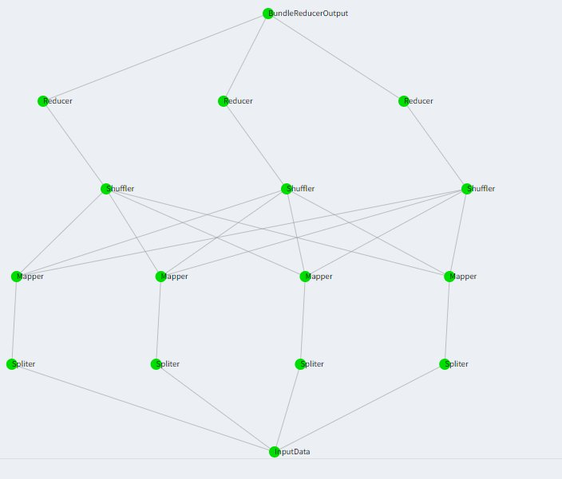

# MapReduce_Luigi

Image of the _Luigi_ pipelines:


To run a docker container:
```docker run --rm -v your/path:/app/data my-map-reduce-app```

We couldn't implement the whole pipeline inside _Kubernetes_, however the docker works properly.
